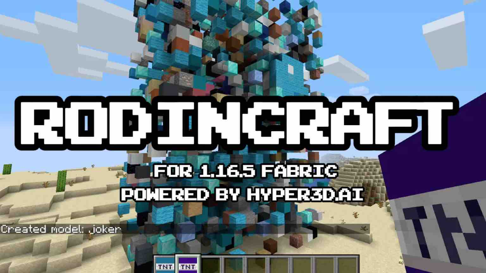

<h1 align="center">RodinCraft</h1>

  
  
  

## Powered by [Hyper3D.AI](https://hyper3d.ai/) Rodin Gen-1.5

This is a Minecraft mod built for the Fabric modding platform, designed to support the conversion of Rodin 3D models (.glb) into Minecraft. 

## Getting started

To get started, make sure you have **Fabric** and the **Fabric API** installed. You can download the Fabric installer from [here](https://fabricmc.net/). After installing Fabric, place the **Fabric API** `.jar` file into your `mods` folder.

Next, download the latest version of this mod from the [Releases](https://github.com/DeemosTech/rodincraft-mc/releases) page and also place the `.jar` file into your `mods` folder.

**Or you can install through the mrpacks provided [here](https://github.com/DeemosTech/rodincraft-mc/releases)**

## Usage

Press **U** to open the screen. 

This mod supports two methods for generating models:

1. **Image to Model**: Drag and drop an image to the screen, and the mod will generate a corresponding 3D model based on the image.
2. **Text to Model**: Enter text, and the mod will create a 3D model based on the input text.
3. **Model to Blocks**: You can directly drag and drop a GLTF model (Suffix `.glb`) to the screen.

Adjust the parameters on the left to fine-tune the generation process. Once you're satisfied, you can click the `Generate` button to generate.

**You have 20 trials per day. If you need more, please visit [our official website](https://hyper3d.ai/).**

https://github.com/user-attachments/assets/1ada475e-debc-4e3c-9b8c-01997e290fae

### Inspired by [Timothy_Barnes](https://www.reddit.com/r/StableDiffusion/comments/1jshond/i_added_voxel_diffusion_to_minecraft/)
